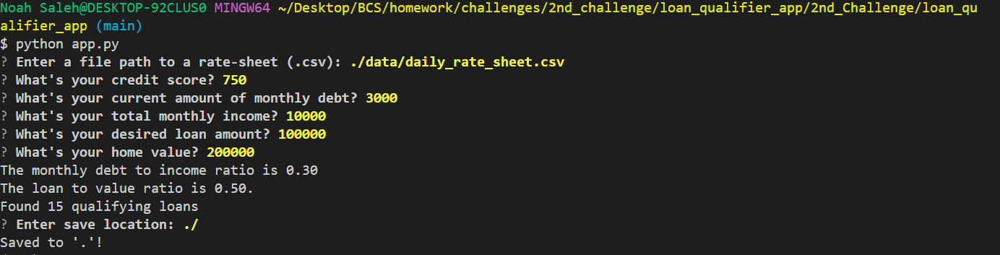

# Loan Qualifier

## Summary of Purpose

This program creates a CSV file containing a list of loans the user is eligible for. All the user has to do is input a few pieces of info, and the program automatically does the rest.

This automation saves the user countless hours of time, and it prevents mistakes that humans are prone to making.

Usuage example: You are applying for a student loan, and you need to know which loans you are eligible for.  
Usuage example: You are applying for a personal loan, and you need to know which loans you are eligible for.

---

## Required/Compatible Technologies

**Compatible OS's:** Mac, Windows, or Linux  
**Programming language:** Python  
**Required libraries:** csv, pathlib, sys, fire, questionary  

Using a conda environment from anaconda is preferable.

You need access to a command line interface for your computer (something like terminal for Mac, GitBash for Windows or Linux).

---

## Installation Guide

Open your command-line interface.
"cd" into your prefered location to save the program.

Copy this: https://github.com/Noah-Saleh/2nd_Challenge.git .
Then type into the command-line, `
git clone
`
. Press space once.
Then hit ctrl+V to paste the link. If they doesn't work, try right clicking. If that doesn't work, try copying the link again and try right clicking in the command-line interface again. Be sure to not left click before you right click.
Hit enter.
So your command should look like this: `git clone https://github.com/Noah-Saleh/2nd_Challenge.git`

Type `cd 2nd_Challenge`. Then hit enter.
Type `cd loan_qualifier_app`. Then hit enter.

To run the program type `python app.py` then hit enter.

---

## Usage

Type your answer to the questions in the command-line interface. Press enter to submit each answer-- note: sometimes you don't have to press enter, as the program will sometimes hit enter for you automatically.

Example usage:

  

Note: this picture is of an earlier version with a bug  
that didn't ask you for permission to save the list before actually saving it.

---

## Contributors

Noah Saleh

email: noahgsaleh@gmail.com

---

## Additional Features

The program also tells you:  
your monthly debt to income ratio AND  
your loan to home-value ratio. 